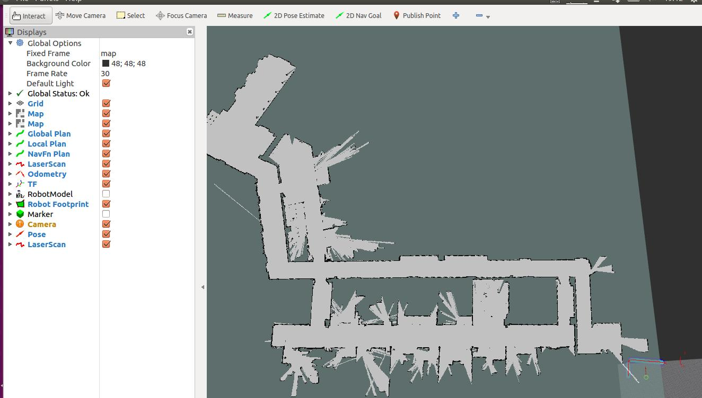
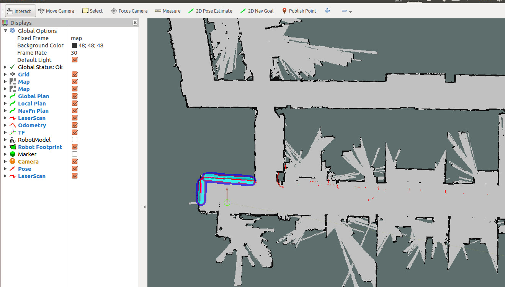

# 语音导航    

通过前面的课程讲解，我们理解了整个实现语音自定义交互的过程。接下来我们讲解的是通过语音交互功能来控制我们

的机器人进行导航的功能实现。而我们的语音导航也是基于前面讲解的自定义交互模式设计的一种功能实现。
   
### 整体效果      
   
   默认demo通过语音下达前往指定点位的指令，可以控制机器人的运行自动导航前往。
   
---
   
#### 实现过程     
   
##### 仿真使用   
      
首先我们得通过唤醒词将机器人唤醒，让他进入唤醒状态。所以我们的前面讲解的语音离线命令词检测和VAD检测得先打

开。

```
roslaunch handsfree_voice offline_interactive_ros.launch//语音交互功能节点
rosrun handsfree_voice vad_record.py//VAD检测节点
```

然后我们运行

```
rosrun handsfree_voice set_goal.py//语音导航节点
```

根据语音第一节的内容,我们可以先使用仿真环境进行测试，先看一下效果 ， 这里我们也提供了相应的仿真环境。

```
roslaunch handsfree_stage demo_handsfree_room_stage.launch

roslaunch handsfree_stage demo_handsfree_xuda_stage.launch

```

这两个都是仿真环境,在空间不够空旷的情况下或者还没熟练的情况下,可以执行其中任意一个就能进行仿真测试。

通过仿真环境,用我们的语音交互的功能去看执行效果,进行语音功能的调试。
   
##### 实机使用   
   
如果对我们的语音功能熟悉了以后，可以使用机器人调试。

首先还是打开我们的语音交互节点

```
roslaunch handsfree_voice offline_interactive_ros.launch//语音交互功能节点

rosrun handsfree_voice vad_record.py//vad检测节点
```

然后我们运行语音导航节点

```
rosrun handsfree_voice set_goal.py//语音导航节点
```

实际使用的话，还要要打开驱动节点

`
roslaunch handsfree_hw handsfree_hw.launch
`

还要运行对应型号的激光雷达驱动节点(HandsFree 默认使用思岚rplidar的雷达)：

打开第二个终端，开启激光节点
`
 roslaunch rplidar_ros rplidar.launch
 `

打开第三个终端，开启move_base节点
 `
 roslaunch handsfree_2dnav move_base_amcl.launch map_name:=my_map
 `

打开第四个终端，开启RVIZ可视化工具
  ``
  rosrun rviz rviz -d `rospack find handsfree_bringup`/rviz/navigation.rviz
  ``

初始位置的标定 通过`2D Pose Estimate`标定初始化位置，直到机器人在地图中的位置和机器人实际的位置一样。

现在就可以尝试语音导航的使用了

   
### 控制核心    
   
```
 if(todo_id==10007&&ifwake==1)
  {
      const char* text ="收到指令，正在前往A点"; //合成文本
      ret =text_to_speech(text, filename_move, session_begin_params);
      if (MSP_SUCCESS != ret)
      {
	    printf("text_to_speech failed, error code: %d.\n", ret);
      }
      printf("合成完毕\n");
      printf("收到前往A点指令\n");
      play_wav((char*)filename_move);
      ifwake=0;
      std_msgs::String msg_pub;
      msg_pub.data ="A";
      pub.publish(msg_pub);
  }
```
```
        self.pose_x = rospy.get_param('~goal_pose_x',0.0)
        self.pose_y = rospy.get_param('~goal_pose_y',0.0)
        self.pose_z = rospy.get_param('~goal_pose_z',0.0)

        self.quat_x = rospy.get_param('~goal_quat_x',0.0)
        self.quat_y = rospy.get_param('~goal_quat_y',0.0)
        self.quat_z = rospy.get_param('~goal_quat_z',0.0)
        self.quat_w = rospy.get_param('~goal_quat_w',1.0)

        self.goal_finish = 0
        self.shutdown_finish = 0
        rospy.on_shutdown(self.shutdown)
        
        rospy.Subscriber('/recognizer/output', String, self.speech_callback)
        # Subscribe to the move_base action server
        self.move_base = actionlib.SimpleActionClient("move_base", MoveBaseAction)
        rospy.loginfo("Waiting for move_base action server...")
        # Wait 60 seconds for the action server to become available
        self.move_base.wait_for_server()
        rospy.loginfo("Connected to move base server")
        rospy.loginfo("Starting navigation test")
        rate = rospy.Rate(10) 
        while 1 :
            if self.goal_finish == 1 :
                self.pose_x = rospy.get_param('~goal_pose_x',0.0)
                self.pose_y = rospy.get_param('~goal_pose_y',0.0)
                self.pose_z = rospy.get_param('~goal_pose_z',0.0)

                self.quat_x = rospy.get_param('~goal_quat_x',0.0)
                self.quat_y = rospy.get_param('~goal_quat_y',0.0)
                self.quat_z = rospy.get_param('~goal_quat_z',0.0)
                self.quat_w = rospy.get_param('~goal_quat_w',1.0)
            elif self.shutdown_finish == 1 : #这个是一个程序退出的检测，如果
                break
            rate.sleep()
```
导航中断停止处理。我们传统的导航程序，与语音交互的导航程序，更加讲究实时性，所以我们要设置一下语音的状态

处理，当我们接受到目标点信息，我们就往目标点前进，中途如果接到唤醒指令，我们就中断目前的任务，在原点等待

新的指令。

```
rospy.loginfo(msg)
        if msg.data == 'A':
            self.pose_x = rospy.get_param('~goal_pose_x',11.3)
            self.pose_y = rospy.get_param('~goal_pose_y',50.1)
            self.pose_z = rospy.get_param('~goal_pose_z',0.0)

            self.quat_x = rospy.get_param('~goal_quat_x',0.0)
            self.quat_y = rospy.get_param('~goal_quat_y',0.0)
            self.quat_z = rospy.get_param('~goal_quat_z',0.0)
            self.quat_w = rospy.get_param('~goal_quat_w',1.0)
      
        elif msg.data == 'shutdown':
            self.shutdown_finish=1
        elif msg.data == 'patrol':
             a=0  #这两个是和巡逻指令配合的适配，如果在同时执行导航功能时，发布巡逻任务的时候不会走导航的原点休息。
        elif msg.data == 'stoppatrol':
             a=0  #这两个是和巡逻指令配合的适配，如果在同时执行导航功能时，发布巡逻任务的时候不会走导航的原点休息。
        else:
            self.pose_x = rospy.get_param('~goal_pose_x',0.0)
            self.pose_y = rospy.get_param('~goal_pose_y',0.0)
            self.pose_z = rospy.get_param('~goal_pose_z',0.0)

            self.quat_x = rospy.get_param('~goal_quat_x',0.0)
            self.quat_y = rospy.get_param('~goal_quat_y',0.0)
            self.quat_z = rospy.get_param('~goal_quat_z',0.0)
            self.quat_w = rospy.get_param('~goal_quat_w',1.0)

        self.goal_finish = 0
	rospy.loginfo('Moving the base through velocity commands')
        goal = MoveBaseGoal()
        goal.target_pose.header.frame_id = 'map'
        goal.target_pose.header.stamp = rospy.Time.now()
            
        quaternion = Quaternion()
        quaternion.x = self.quat_x
        quaternion.y = self.quat_y
        quaternion.z = self.quat_z
        quaternion.w = self.quat_w
        goal.target_pose.pose.position.x = self.pose_x 
        goal.target_pose.pose.position.y = self.pose_y
        goal.target_pose.pose.position.z = self.pose_z 
        goal.target_pose.pose.orientation = quaternion
            
        self.move_base.send_goal(goal,self.donecb,self.activecb,self.feedbackcb)
```
运行可视化节点，加载对应的rviz配置文件，显示地图和相关传感器的可视化数据:



   
#### 初始位置的标定      
   
在RVIZ地图中看到的机器人的初始位置可能并不是其当前在地图中的实际位置，为了机器人能实现导航，我们需要手动

标定初始位置。

点击RVIZ菜单栏的`2D Pose Estimate`图标。

将鼠标移动到机器人在地图中的实际位置，摁住左键，调整好方向后松开。

重复以上动作，直到机器人在地图中的位置和机器人实际的位置一样。可以观察激光雷达的数据和地图的边界是不是吻

合上。
   
##### 在仿真情况下，不需要进行实际位置校准，仿真环境下，初始化就是一个准确的，仿真雷达数据和地图边界吻合的，如果进行位置校准，会出现位置信息不准确，出现问题。   
   
标定好的效果如下：



这里我们通过修改坐标点，来设置我们的目标点位，首先，我们就得根据雷达建图来获取一个图。然后根据雷达的建图
打开的rviz，通过rviz的`Publish  Point`寻找几个合适的点位。雷达建图的细节，根据前面相对应的教程来学习。设
定号点位后，我们修改ABCD点（这里的ABCD点可以具象化为对应的位置，比如厨房，客厅，卫生间等）的相应坐标来设
定点位。这里我们列举了A点的例子，即

```
if msg.data == 'A':
            self.pose_x = rospy.get_param('~goal_pose_x',11.3)//只需要修改这两个点位X坐标
            self.pose_y = rospy.get_param('~goal_pose_y',50.1)//Y坐标
            self.pose_z = rospy.get_param('~goal_pose_z',0.0)

            self.quat_x = rospy.get_param('~goal_quat_x',0.0)
            self.quat_y = rospy.get_param('~goal_quat_y',0.0)
            self.quat_z = rospy.get_param('~goal_quat_z',0.0)
            self.quat_w = rospy.get_param('~goal_quat_w',1.0)
```

这时候在通过我们的语音交互下达相应的指令，就可以实现语音导航。

下面是一个科大讯飞的错误码信息查询，如果在调用科大讯飞的时候报错了相关的错误码，可以通过这个链接查询。
[科大讯飞错误码信息查询](https://www.xfyun.cn/document/error-code)
